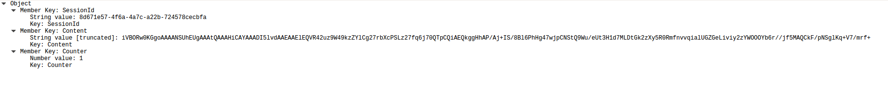

# Challenge 2

Looking at the given .pcap file, there are the following activities:

  1. HTTP Traffic:
    * http://www.aljazeera.net - GET
    * /portal - GET
    * /sessions - POST
    * /messages - POST
    * jihadintel.meforum.org - GET
    * hamas.ps - GET
  2. TLS traffic - which I assume is irrelevant
  3. ARP / DNS - which I assume is irrelevant

I've decided to focus on the http files. Since /session and /messages had the most suspicious name I've decided to look at these first:


## /Sessions

[!pcap /session](res/session_post_data.png)

This looks promising! It contains a JSON with two fields - a session ID, and an array of URLS.

When inspecting the given URLS - there are some funny res/looking .png images, like this one:


## /Messages

When inspecting the message object - it is seen that its `Content` value is coded in base64:



It also has a `Counter` and `SessionId` fields. The `SessionId` is the same for the the message object but the counter is increasing on every message.

It is also seen that the `/message` JSONs are transferred from `192.168.202.1` and `192.168.202.128` in a chat-like manner.

When decoding the base64 from the content - We get images that are VERY similar the the ones in the URLS:


I've downloaded the images that were in the `Url` field on the `/session` POST JSON and called them `base%d`
We can see that those differ from the original ones:


Let's try and see which pixels are different via some Python. For that - I've used OpenCV.
A good method to see which pixels are different is XOR:


If we run this on other images - we can see that all the pixels only differ on the 'B' component of each pixel and only in the first row! Maybe the message was decoded on top of that area then?

I've decided later on to make an experiment - maybe the text was XOR'd on the 'B' component?


**JACKPOT!** Let's try this on image #1 as well!


OK... This did not go well. Let's print the binary repr of the characters:


It can be seen that only even ascii codes are interpreted right! If we recall our `/message` JSON - It had a `Counter` field. So let's XOR with that:


Awesome! So everything we should do is to XOR with the counter and XOR with the base image!
Here is a simple script that achieves this:

```python
if __name__ == "__main__":
    base = cv2.imread(sys.argv[1])
    img = cv2.imread(sys.argv[2])
    counter = int(sys.argv[3])

    base = base[0,:,2]
    img = img[0,:,2]

    xor = cv2.bitwise_xor(base, img)
    xor = cv2.bitwise_xor(xor, counter)

    result = ''
    for element in xor:
        if chr(element) in string.printable:
            result += chr(element)

    print(result)
```

And the final result:


