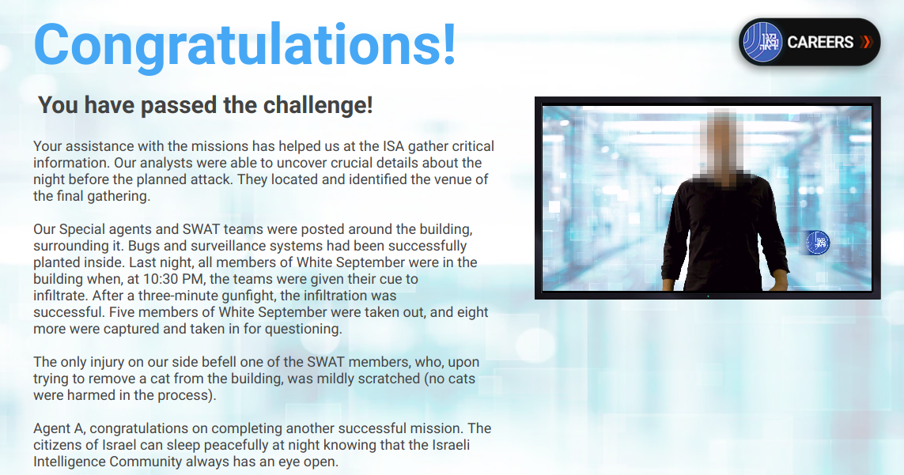

# Shabak CTF 2018

I've finished the Embedded Software tasks so I decided to do a writeup!
This is my FIRST writeup! Please be forgiving :)

This CTF had tow challnges, one with an embedded-MMUless system and one with a .pcap file parsing task.

You can read about each one of those in the following markdown files:
  * [First Challenge](01/README.md)
  * [Second Challenge](02/README.md)

